<!-- Hero Banner — Animated 3D grid spelling ARYAN with breathing cubes + signal wave -->

  

  
  

---

<table width="100%" border="0" cellspacing="0" cellpadding="0">
  <tr>
    <td width="50%" align="center" valign="top">
      
    </td>
    <td width="50%" align="center" valign="top">
      
    </td>
  </tr>
</table>

---

  

---

<table width="100%" border="0" cellspacing="0" cellpadding="0">
  <tr>
    <td width="50%" align="center" valign="top">
      
    </td>
    <td width="50%" align="center" valign="top">
      
    </td>
  </tr>
</table>

---

  

---

## ⚡ Featured Projects

<table width="100%" border="0" cellspacing="0" cellpadding="8">
  <tr>
    <td width="33%" valign="top">
      <h3>🔍 RepoLens</h3>
      
AI-powered repository analysis platform — architecture insights, documentation, dependency visualization, and code intelligence.

      
<code>Python</code> <code>FastAPI</code> <code>React</code>

    </td>
    <td width="33%" valign="top">
      <h3>🔐 ZeroTrace</h3>
      
Secure encryption and permanent data destruction utility implementing AES-256 with forensic-resistant workflows.

      
<code>Java</code> <code>Spring Boot</code> <code>AES-256</code>

    </td>
    <td width="33%" valign="top">
      <h3>🧠 Vela</h3>
      
A causal reasoning engine that extracts cause-effect relationships from natural language into explainable directed graphs.

      
<code>Python</code> <code>NumPy</code> <code>NLP</code>

    </td>
  </tr>
</table>

---

  &nbsp;&nbsp;
  &nbsp;&nbsp;
  

  

