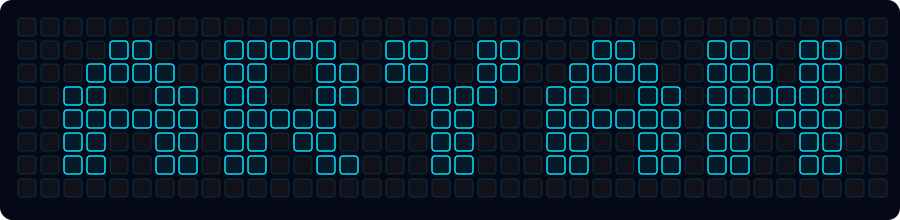
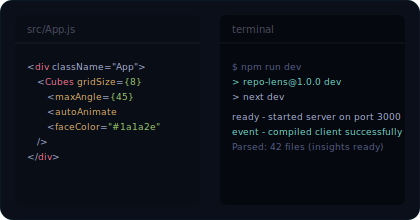
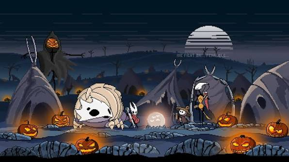

🟧🟧🟧🟧🟧🟧🟧🟧🟧🟧🟧🟧🟧🟧🟧🟧🟧🟧🟧🟧🟧🟧🟧🟧🟧🟧🟧🟧🟧🟧🟧🟧🟧🟧🟧🟧🟧🟧🟧🟧🟧🟧🟧<!-- Hero Banner — animated 3D grid spelling ARYAN, signal wave + breathing cubes -->

  

🟧🟧🟧🟧🟧🟧🟧🟧🟧🟧🟧🟧🟧🟧🟧🟧🟧🟧🟧🟧🟧🟧🟧🟧🟧🟧🟧🟧🟧🟧🟧🟧🟧🟧🟧🟧🟧🟧🟧🟧🟧🟧🟧
  
<table>
<tr>
<td width="150"></td>
<td> Zero Trace</td></td>
<td width="322"></td>
<td> RepoLens </td>
<td width="180"></td>
</tr>
</table>

<!-- ZeroTrace VAULT + Binary Room side by side -->
<table width="100%" border="0" cellspacing="0" cellpadding="0">
  <tr>
    <td width="50%" align="center" valign="top">
      
    </td>
    <td width="50%" align="center" valign="top">
      
    </td>
  </tr>
</table>

 
🟧🟧🟧🟧🟧🟧🟧🟧🟧🟧🟧🟧🟧🟧🟧🟧🟧🟧🟧🟧🟧🟧🟧🟧🟧🟧🟧🟧🟧🟧🟧🟧🟧🟧🟧🟧🟧🟧🟧🟧🟧🟧🟧
  
<table>
<tr>
<td width="75"></td>
<td> About Me</td></td>
<td width="322"></td>
<td> My Favourite </td>
<td width="230"></td>
</tr>
</table>

<!-- About bio + Silksong pixel art side by side -->
<table width="100%" border="0" cellspacing="0" cellpadding="0">
  <tr>
    <td width="30%" align="center" valign="top">
      
    </td>
    <td width="70%" align="center" valign="middle">
      
    </td>
  </tr>
</table>

🟧🟧🟧🟧🟧🟧🟧🟧🟧🟧🟧🟧🟧🟧🟧🟧🟧🟧🟧🟧🟧🟧🟧🟧🟧🟧🟧🟧🟧🟧🟧🟧🟧🟧🟧🟧🟧🟧🟧🟧🟧🟧🟧

##  Stack & Arsenal

<!-- Tech stack infinite marquee -->

  

🟧🟧🟧🟧🟧🟧🟧🟧🟧🟧🟧🟧🟧🟧🟧🟧🟧🟧🟧🟧🟧🟧🟧🟧🟧🟧🟧🟧🟧🟧🟧🟧🟧🟧🟧🟧🟧🟧🟧🟧🟧🟧🟧

##  what i've been shipping

<table width="100%" border="0" cellspacing="0" cellpadding="8">
  <tr>
    <td width="33%" valign="top">
      <h3>🔍 RepoLens</h3>
      
drop any repo link and get architecture diagrams, docs, and dependency maps auto-generated. like having a senior dev explain the codebase.

      
<code>Python</code> <code>FastAPI</code> <code>React</code>

    </td>
    <td width="33%" valign="top">
      <h3>🔐 ZeroTrace</h3>
      
AES-256 encryption + secure file shredding. the kind of thing you build because you actually care about privacy, not just as a portfolio piece.

      
<code>Java</code> <code>Spring Boot</code> <code>AES-256</code>

    </td>
    <td width="33%" valign="top">
      <h3>🧠 Vela</h3>
      
feeds on raw text and spits out cause-effect graphs. trying to make reasoning something you can actually see and trace.

      
<code>Python</code> <code>NumPy</code> <code>NLP</code>

    </td>
  </tr>
</table>

🟧🟧🟧🟧🟧🟧🟧🟧🟧🟧🟧🟧🟧🟧🟧🟧🟧🟧🟧🟧🟧🟧🟧🟧🟧🟧🟧🟧🟧🟧🟧🟧🟧🟧🟧🟧🟧🟧🟧🟧🟧🟧🟧

## Contribution Activity

<!-- Contribution graph sits here — scroll past the noise first -->

  

🟧🟧🟧🟧🟧🟧🟧🟧🟧🟧🟧🟧🟧🟧🟧🟧🟧🟧🟧🟧🟧🟧🟧🟧🟧🟧🟧🟧🟧🟧🟧🟧🟧🟧🟧🟧🟧🟧🟧🟧🟧🟧🟧

##  find me

  &nbsp;&nbsp;
  &nbsp;&nbsp;
  

  

