<h1 align="center">Hi 👋, I'm Aryan Nair</h1>

<h3 align="center">
Computer Science (AI) Student • Backend Developer • AI Enthusiast • Open Source Contributor
</h3>

Building practical software at the intersection of <b>Artificial Intelligence</b>, <b>Backend Engineering</b>, and <b>Cybersecurity</b>.

---

# 💫 About Me

🔭 **Currently Building:** **RepoLens** – An AI-powered repository analysis platform

🤝 **Looking to Collaborate On:** Open Source, AI, Backend, and Developer Tooling projects

🌱 **Currently Learning:** Agentic AI, RAG Systems, System Design, Kubernetes, and Data Structures & Algorithms

💬 **Ask Me About:** Python, Java, FastAPI, Spring Boot, Git, AI Projects, or Hackathons

🎯 **Current Goal:** Build production-quality software while contributing to open source and continuously improving as a software engineer.

⚡ **Fun Fact:** I believe the fastest way to learn is to build real projects, break them, rebuild them, and share them with the world.

---

# 🚀 Featured Projects

### 🔍 RepoLens
AI-powered repository analysis platform that generates architecture insights, documentation, dependency visualization, and code intelligence.

### 🔐 ZeroTrace
Secure encryption and permanent data destruction utility implementing AES-256 encryption with forensic-resistant workflows.

### 🧠 Vela
A causal reasoning engine that extracts cause-effect relationships from natural language into explainable directed graphs.

### 🚌 Mov
Real-time campus transportation platform built using Spring Boot, JWT Authentication, MySQL, and Leaflet Maps.

### 📱 Controller
Remote keyboard and desktop controller that allows a mobile device to control a computer wirelessly.

---

# 💥 Commit Bomb Calendar

Every square below is a day from the last year. If I shipped a commit that day, it detonates — the calendar sweeps left to right and re-detonates on a loop. No commit, no boom.

  

Auto-regenerated daily from my real contribution graph via GitHub Actions. See <code>scripts/generate-bomb-svg.js</code> and <code>.github/workflows/bomb.yml</code>.

---

# 💻 Tech Stack

### Languages

### Frameworks & Libraries

### Databases

### AI & Data

### Tools

---

# 📈 GitHub Stats

---

# 📊 Contribution Graph

---

# 🎯 2026 Goals

- 🚀 Launch RepoLens v1.0
- 🧠 Strengthen Data Structures & Algorithms
- 🤖 Deepen expertise in Agentic AI & RAG
- 🌍 Make meaningful Open Source contributions
- 💼 Secure a Software Engineering Internship

---

# 🌐 Connect With Me

---

